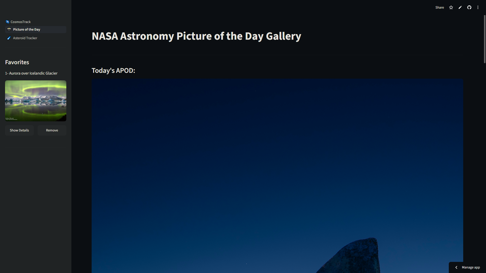
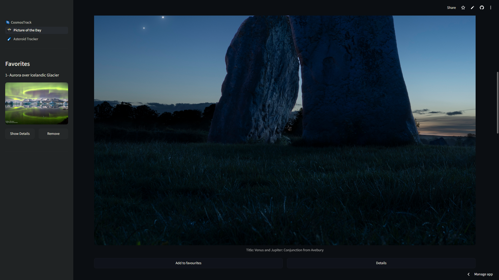
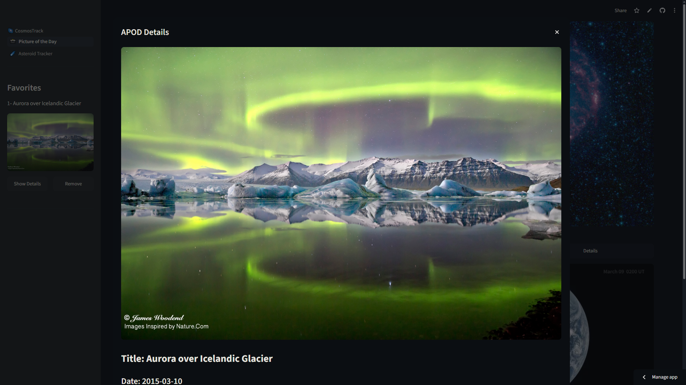
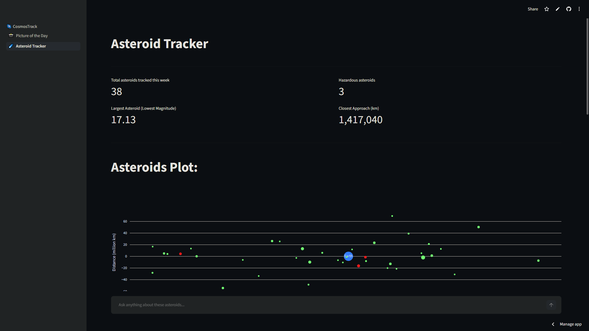
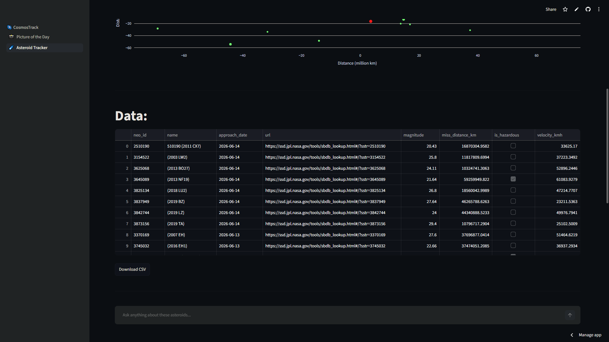
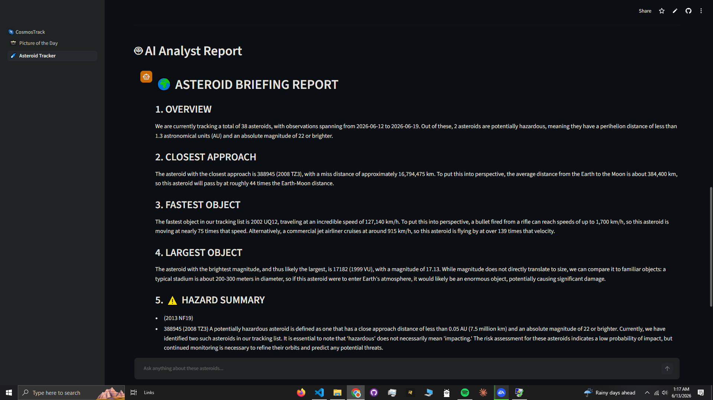
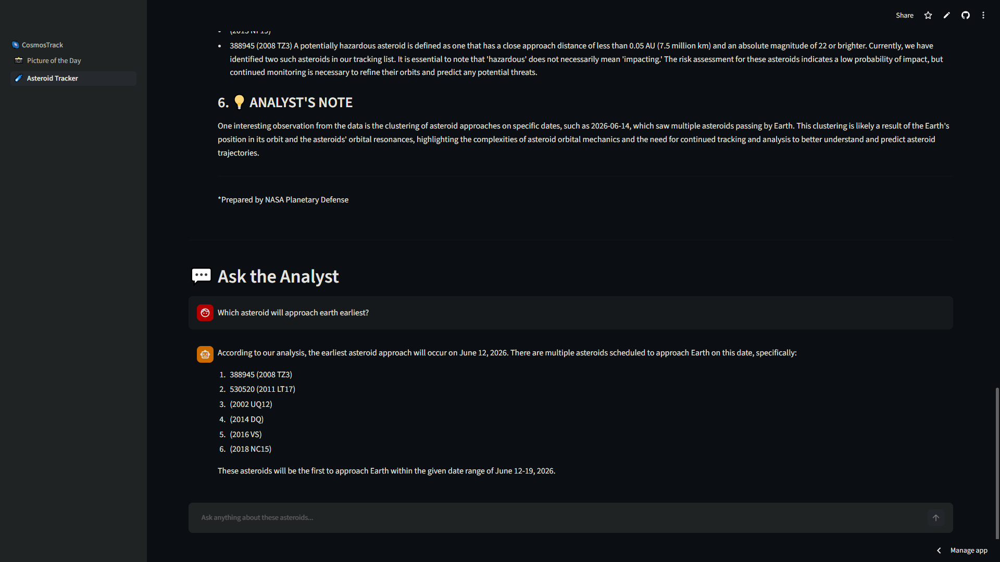

# 🚀 CosmosTrack

An AI-powered NASA exploration platform built with Streamlit that combines real-time space data, asteroid monitoring, interactive visualizations, and AI-assisted analysis.

[](https://cosmostrack.streamlit.app)
---

# Overview

CosmosTrack brings NASA's public datasets into an interactive dashboard where users can explore astronomy content, monitor near-Earth asteroids, and generate AI-powered insights from live space data.

The application integrates NASA APIs, data visualization, and large language models to provide an engaging space exploration experience.

---

## Key Highlights

- Real-time NASA API Integration
- Near-Earth Asteroid Monitoring
- Interactive Plotly Visualizations
- AI-Powered Space Analysis
- Multi-Page Streamlit Application

---

# Features

## 🌌 Astronomy Picture of the Day (APOD)

* View NASA's Astronomy Picture of the Day
* Explore historical APOD entries by date
* Save favourite discoveries
* Persistent favourites storage

---

## ☄️ Asteroid Tracker

* Live Near-Earth Object monitoring
* Data powered by NASA NeoWs API
* Hazardous asteroid detection
* Closest approach analysis
* Largest asteroid tracking
* Interactive visualizations

---

## 🤖 AI Space Analyst

Generate automated asteroid reports using LLMs.

Capabilities:

* Risk summaries
* Data interpretation
* Space object analysis
* Follow-up conversational chat

Powered by Groq + LLaMA 3.3 70B.

---

# Architecture

```text
NASA APIs
     │
     ▼
Data Collection
     │
     ▼
Data Processing
     │
     ├── APOD Module
     │
     ├── Asteroid Analytics
     │
     └── AI Space Analyst
             │
             ▼
      Groq LLM Integration
             │
             ▼
      Streamlit Dashboard
```

---

# Technology Stack

### Backend

* Python
* Requests
* Pandas

### Frontend

* Streamlit
* Plotly

### AI

* Groq API
* LLaMA 3.3 70B

### Data Sources

* NASA APOD API
* NASA NeoWs API

---

# Local Installation

```bash
git clone https://github.com/AliAkbar4025/CosmosTrack.git
cd CosmosTrack

pip install -r requirements.txt

streamlit run app.py
```

Create:

```toml
.streamlit/secrets.toml
```

```toml
NASA_API_KEY = "your_nasa_api_key"
GROQ_API_KEY = "your_groq_api_key"
```

---

# 📸 Screenshots

## Main Dashboard

<p align="center">
  
</p>

<br>

## 🌌 APOD Explorer

<p align="center">
  
  
</p>

<br>

## ☄️ Asteroid Tracker

<p align="center">
  
  
</p>

<br>

## 🤖 AI Space Analyst

<p align="center">
  
  
</p>

---

# Author

**Agent Orbit team**

